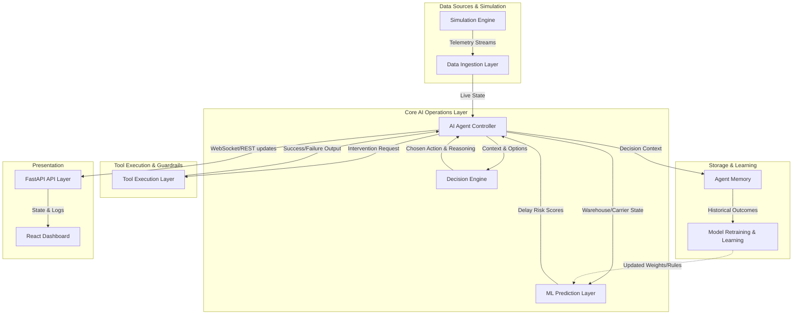

# System Architecture: FlowMind

FlowMind is designed as a modular, scalable AI operations platform. Its architecture reflects a real-world enterprise logistics AI system, moving beyond a simple script to a robust, microservices-style structure.

## Overview

The system implements a continuous **Observe → Reason → Decide → Act → Learn** loop.

## Module Breakdown

### 1. Logistics Simulation Engine (`simulation/`)
Generates realistic, real-time logistics data. Simulates 1000-5000 shipments across major cities (Mumbai, Delhi, Bangalore, Hyderabad, Pune).
- Injects dynamic variations: Carrier reliability fluctuations (e.g., weather events), warehouse congestion drops, and random ETA spikes.

### 2. Data Ingestion Layer (In-Memory / SQLite)
Collects the unstructured or streaming telemetry from the simulation and standardizes it into actionable states for the AI Controller.

### 3. AI Agent Controller (`agent/logistics_agent.py`)
The orchestrator. It manages the agent loop, pulling current telemetry, invoking the ML models for predictions, pushing the context to the Decision Engine, and triggering the Tool Layer based on the results. Often powered by a framework like LangGraph for cyclical graph logic.

### 4. ML Prediction Layer (`models/delay_prediction.py`)
Provides deterministic delay prediction and risk scoring.
- Uses a `RandomForestClassifier`.
- **Inputs**: Warehouse load (%), Carrier Reliability (0-1), Distance (km), ETA (hours).
- **Outputs**: Delay Probability Score (0.0 - 1.0).

### 5. Decision Engine (`agent/decision_engine.py`)
Evaluates the delay probabilities alongside operational rules.
- Contains the "Reasoning" capability: it balances delivery time, cost, and reliability to select interventions (e.g., if risk > 0.85 -> Reroute).
- Produces the human-readable explanation strings required by the system.

### 6. Tool Execution Layer (`tools/`)
The interface between the Agent Controller and the "real world" (simulation state). Provides strict, well-defined tools:
- `reroute_tool.py`: Changes route.
- `carrier_switch_tool.py`: Re-assigns carrier.
- `prioritize_tool.py`: Adjusts warehouse queue priority.
- `alert_tool.py`: Escalates to a human operator.

### 7. Agent Memory (`agent/memory.py`)
Stores previous state, ongoing risks, and past decisions so the agent remembers what it did 5 minutes ago and doesn't spam duplicate actions.

### 8. API Layer (`api/main.py`)
Built with FastAPI. Exposes endpoints to fetch current shipment states, warehouse metrics, carrier scores, and streaming agent decision logs.

### 9. Frontend Dashboard (`frontend/`)
A React-based user interface visualizing the logistics network, surfacing risk scores, and displaying a live feed of the Agent's reasoning, decisions, and executed actions.
